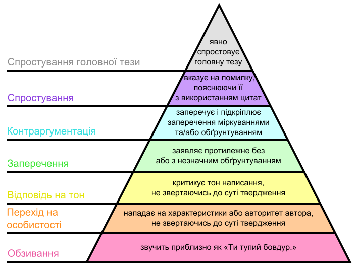

# Правила чату D7 Київ

Ці правила розповсюджуються на всіх в чаті [@kyiv_D7](https://t.me/kyiv_D7).

Основні цілі: питання-відповіді та провадження конструктивних дискусій по діяльності Київського осередку Д7 та м.Києва.

## Прохання:

* Мати повагу одне до одного
* Не матюкатися в сторону людей
* Писати максимально стисло і одним повідомленням
* Обговорювати тільки речі, що дотичні до діяльності/компетенцій Київського осередку
* Не відповідати на тези що здаються вам образливими, а краще кликати адмінів

## Ви можете:

Прочитати ці правила за посиланням: [d7-kyiv.github.io/tg-chat-rules](https://d7-kyiv.github.io/tg-chat-rules).

Повідомити про невідповідні повідомлення, за допомогою команди `/admin` (`/admins`) y якості відповіді

## 🔨 RO_POLL

Кожен учасник спільноти може розпочати процес відправки в ReadOnly іншого учасника.

Для запуску використовуйте команду `/set_readonly24h_poll`. При зборі необхідної кількості голосів, бот відправить учасника в RO на 24 години.

## Діяльність адміністраторів

🐈 Адміністратори та модератори мають надсилати `/w` або `/warn` на невідповідні повідомлення. Після 3 попереджень користувач буде забанений на 1 тиждень.

В разі грубого порушення правил чату, за власною ініціативою чи за проханням учасника чату, адміністрація може відправляти в RO без жодних попереджень. У крайніх випадках, таких як спам, банити.

Будь що, не дотичне до діяльності осередку, та коментарі на кшталт «за що», «доколє», та дуже емоційні реакції мають пересилатися у [@kyiv_d7_flood](https://t.me/kyiv_d7_flood).

## Оскарження дій адміністраторів

Рішення адміністрації можна оскаржити не раніше ніж через годину після інциденту і, бажано, після прийняття холодного душу (нам важливе як наше, так і ваше емоційне та фізичне здоров'я) шляхом звернення до Голови осередку (в разі відсутності - до виконуючого обов'язки, відповідно до [структури осередку](/#structure)).

Термін оскарження дій адміністрації спливає через 3 доби після накладених обмежень.

## Інші рекомендації

* Якщо сприймати співрозмовника як дуже розумного маньяка, що знає де ви живете, і має відмінний від вашого життєвий досвід, ймовірність порушення правил буде мінімальною.
* Ми тут зібралися заради конструктиву. Почесати язиком, пожалітися на погоду-природу та просто поспілкуватись за життя — це в @kyiv_d7_flood.
* З загально партійними питаннями — в @D7chat.
* Якщо у вас поганий настрій — краще взагалі нічого ніде не писати. Без вашої відповіді прямо зараз (якщо ви не напряму за це відповідаєте), ніхто не помре.
* Враховуйте, що чат читають новачки, що надихаються нашою поведінкою, а також представники інших політичних сил і правоохоронні органи, що можуть використати наш коментар проти партії.

Дякуємо що прочитали правила.

## Приклади і роз’яснення для тих хто хоче більше

Майже гарантовано **RO прилетить за**:

* _- іди нахуй_
* _- от же ти й блядіна_
* _- звідки ти такий довбойоб узявся?_
* Особисті нападки
* Громадське або приватне переслідування
* Публікація особистої інформації іншої особи, наприклад фізичні чи електронні адреси, без явного дозволу
* та ін.

**Попередження** майже гарантовано **прилетить за**:

* _- в мене на районі таких як ти обілечують_
* _- чи не засланий ти козачок?_
* _- от думав, чого от у вас морда знайома. І згадав що ту собаку ми вже приспали_
* _- ти хто і що тут забув?_
* Грубий чи деструктивний тролінг
* Образливі / жахливі коментарі
* та ін.

Будь-яке **пониження рівня дискусії** (див. Діаграму Грема) автоматично трактується як підозріле і таке, що може викликати попередження. Пониження рівня дискусії нижче Заперечення, майже автоматично викличе попередження і/або RO.

{ width="650" }

Якщо ви зацікавлені у веденні якісної дискусії, але не маєте достатнього досвіду, радимо ознайомитись з [Правилами ведення суперечки](https://miyklas.com.ua/p/ukrainska-mova/10-klas/praktichna-ritorika-342122/superechka-iak-vid-komunikatciyi-riznovidi-superechki-pravila-vedennia-s_-342296/re-4be5942f-dc86-4ca4-b507-e40ea3b31c05).

Також, не зайвим буде ознайомитись з тим [як правильно ставити запитання](https://jvns.ca/blog/good-questions/) [en] і [nometa.xyz](https://nometa.xyz/uk.html) та [як відповідати на запитання з користю для всіх](https://jvns.ca/blog/answer-questions-well/) [en].

В разі появи занадто великої кількості повідомлень, адмін перестає бути добрим, починає все уважно читати і роздавати попередження всьому що погано написано. Тому що генерувати купу повідомлень - це неповага до часу людей, що це все читатимуть.

 

Такий шлях Бене Ґессерит.
